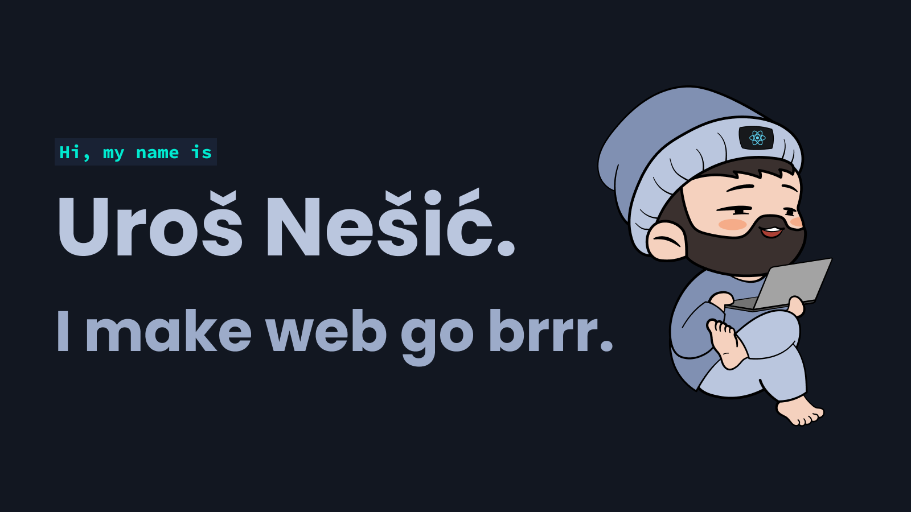

<a href="https://unesic.io/" title="unesic.io" target="_blank">
  <picture>
    <source media="(prefers-color-scheme: light)" srcset="thumbnail-light.png">
    <source media="(prefers-color-scheme: dark)" srcset="thumbnail-dark.png">
    
  </picture>
</a> 

# Hey there 👋🏻

I'm Uroš, a software engineer currently specializing in full-stack web development with primary focus on the front-end technologies.

Want to know more about me? [Check out my website.](https://unesic.io)

## 📈 GitHub stats

## 🛠 Skills

### ...and also

